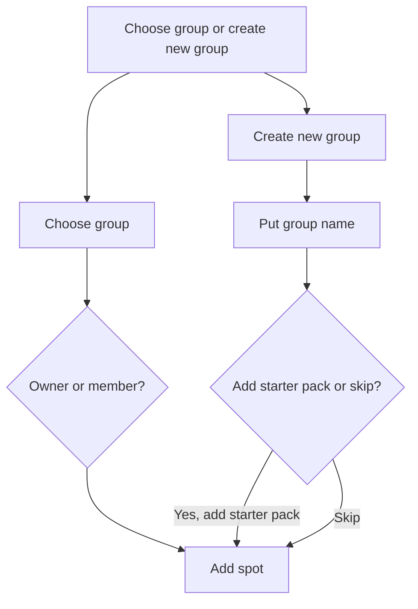
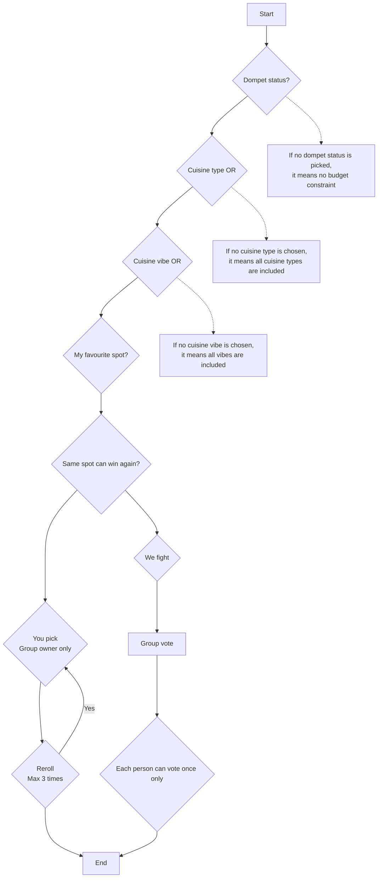
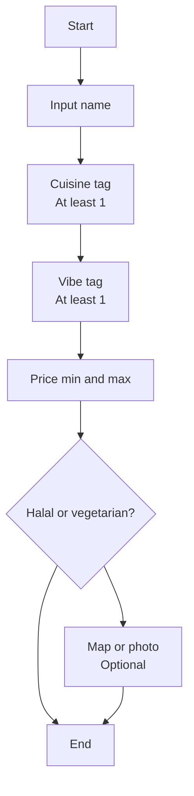

# Jiak Hami App Flowchart Documentation

## 1. Group Selection / Group Creation Flow



---

## 2. Food Decision Flow



---

## 3. Add Spot Flow



---

# Flow Explanation

## 1. Group Selection / Group Creation

The user first chooses whether to join an existing group or create a new group.

If the user chooses an existing group, the system checks whether the user is the group owner or a member. After that, the user can proceed to add food spots.

If the user creates a new group, the user needs to enter a group name. After creating the group, the user can decide whether to add a starter pack or skip this step. Both options will lead to the add spot process.

---

## 2. Food Decision Process

The food decision process starts with several filters.

First, the user selects the dompet status, which represents the budget condition. If no dompet status is selected, the system will treat it as no budget constraint.

Next, the user can select cuisine type. The cuisine type uses OR logic, meaning the result can match any selected cuisine type. If no cuisine type is selected, all cuisine types will be included.

After that, the user can select cuisine vibe. This also uses OR logic. If no cuisine vibe is selected, all vibes will be included.

The system then checks whether the user wants to include favourite spots and whether the same spot can win again.

After filtering, there are two decision modes:

### You Pick

- Available for group owner only.
- The group owner can reroll the result.
- Reroll is limited to a maximum of 3 times.

### We Fight

- The group will vote together.
- Each person can vote only once.
- The result is decided based on the group vote.

---

## 3. Add Spot Process

The add spot process allows users to add new food places into the group.

The required fields are:

| Field | Requirement |
|---|---|
| Spot name | Required |
| Cuisine tag | At least 1 required |
| Vibe tag | At least 1 required |
| Price min and max | Required |
| Halal or vegetarian status | Optional / selectable |
| Map or photo | Optional |

After the information is entered, the spot is added and the process ends.

---

# Logic Notes

## Cuisine Type Logic

Cuisine type uses **OR logic**.

Example:

If the user selects:

- Malay
- Chinese
- Western

The system can show spots that match any of these cuisine types.

```text
Malay OR Chinese OR Western
```

---

## Cuisine Vibe Logic

Cuisine vibe also uses **OR logic**.

Example:

If the user selects:

- Air-conditioned
- Cheap
- Pet-friendly

The system can show spots that match any of these vibes.

```text
Air-conditioned OR Cheap OR Pet-friendly
```

---

## Combined Filter Logic

Cuisine type and cuisine vibe are treated as different filter groups.

Inside each group, the logic is OR.

Between different groups, the logic is AND.

Example:

```text
Cuisine Type: Malay OR Chinese OR Western
AND
Vibe: Air-conditioned OR Cheap
```

This means the result must match at least one cuisine type and at least one vibe.

---

# Recommended Feature Rules

## Group Rules

- A user can choose an existing group or create a new group.
- A group owner has more control than a normal member.
- Only the group owner can use the “You pick” mode.
- Members can join the “We fight” voting mode.

## Voting Rules

- Each person can vote once only.
- The final result should be based on the highest number of votes.
- If there is a tie, the system can randomly pick one winner from the tied spots.

## Reroll Rules

- Reroll is only available in “You pick” mode.
- Reroll is limited to a maximum of 3 times.
- After 3 rerolls, the user must accept the result or restart the process.

## Spot Rules

- Each spot must have at least one cuisine tag.
- Each spot must have at least one vibe tag.
- Price range should include minimum and maximum price.
- Map or photo is optional.
- Halal or vegetarian status can be used as an additional filter.
